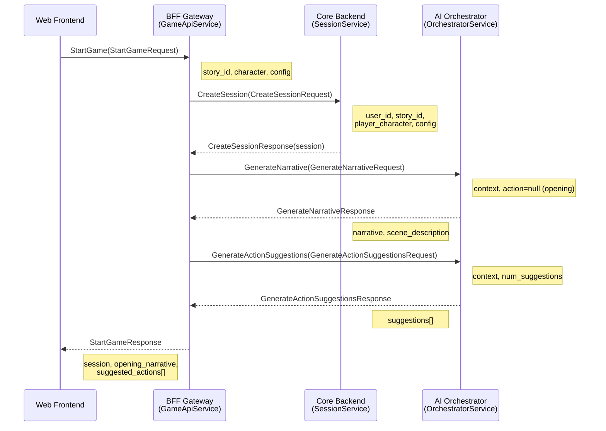
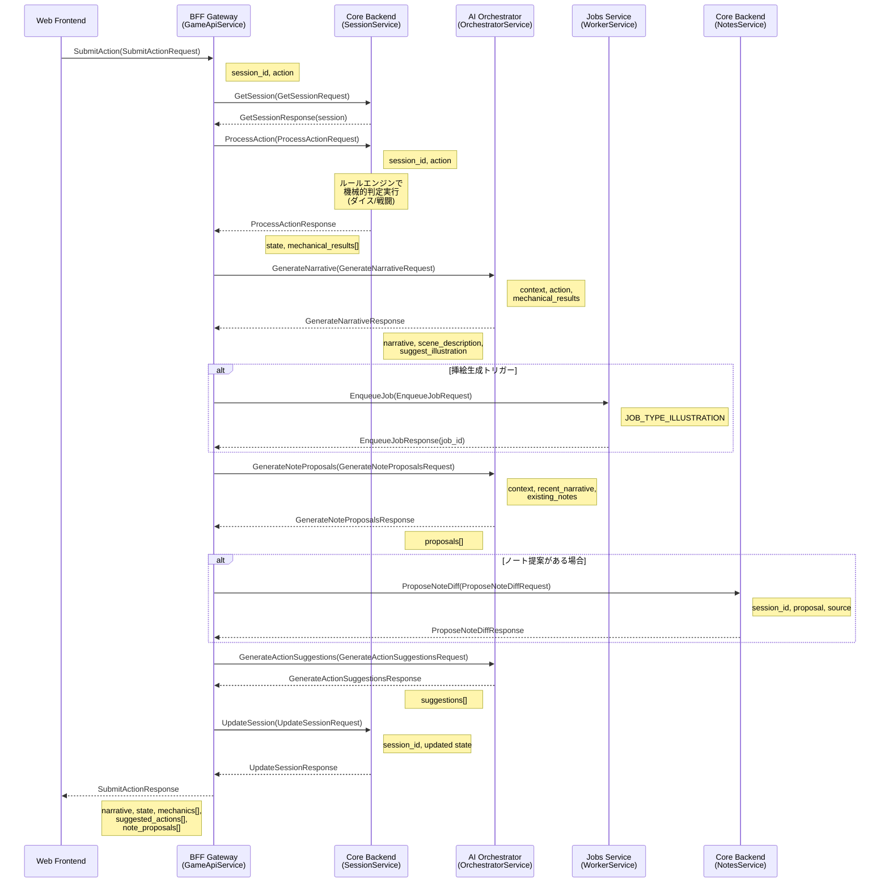
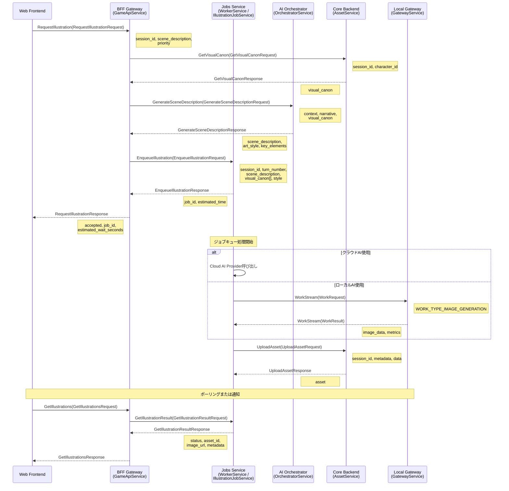
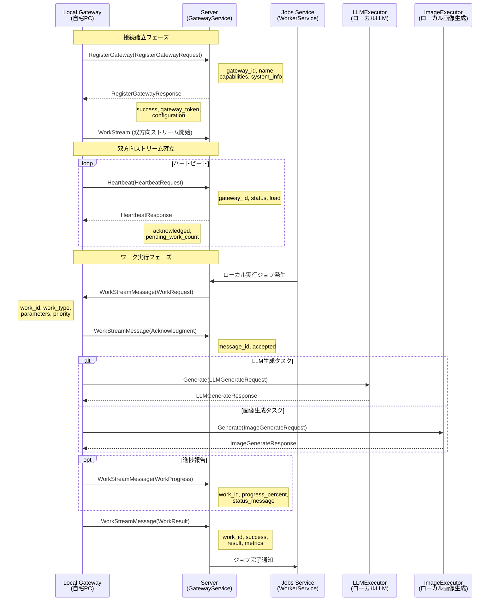
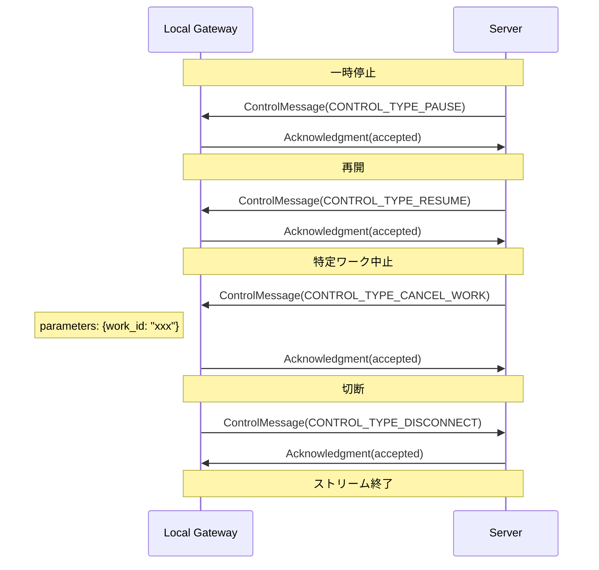
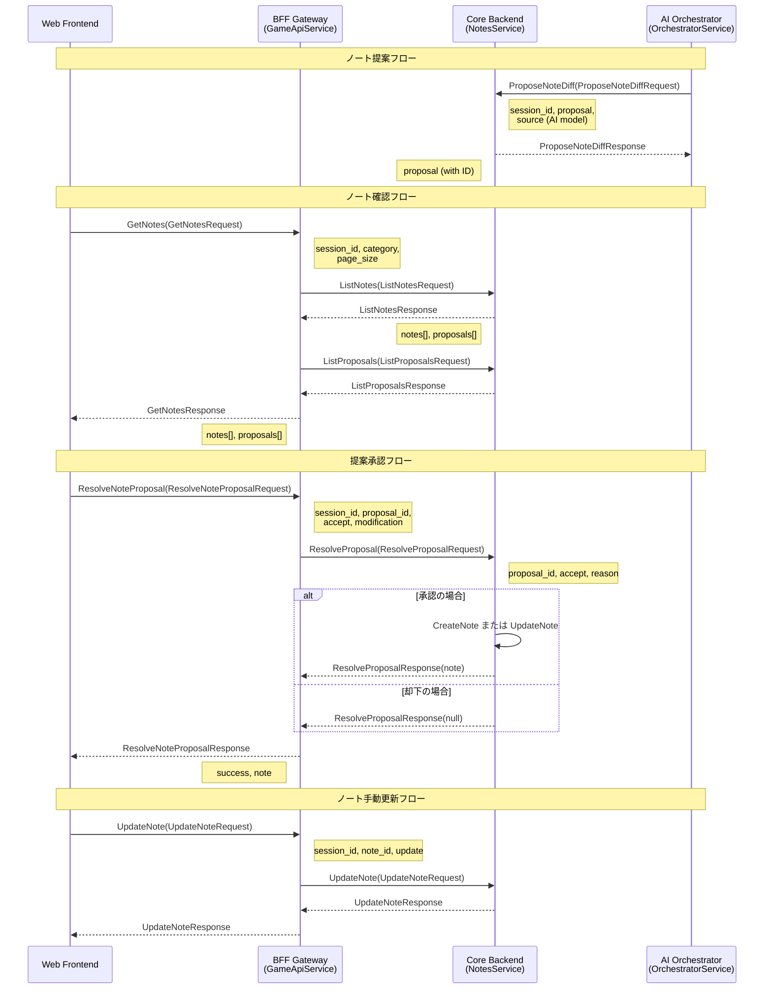
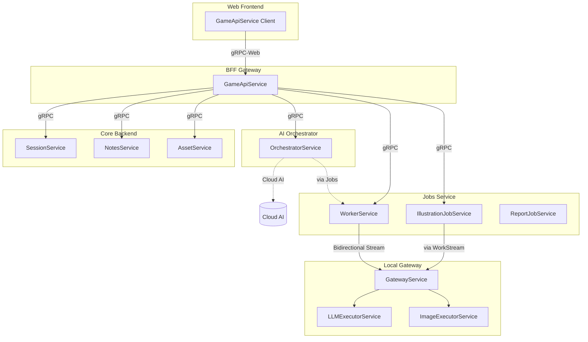

# API シーケンスダイアグラム

本ドキュメントでは、TextRPG プラットフォームの gRPC API 呼び出しの関係性をシーケンスダイアグラムで示します。

## 目次

1. [システム概要](#システム概要)
2. [ゲーム開始フロー](#ゲーム開始フロー)
3. [プレイヤーアクション処理フロー](#プレイヤーアクション処理フロー)
4. [挿絵生成フロー](#挿絵生成フロー)
5. [ローカルゲートウェイ双方向ストリーミング](#ローカルゲートウェイ双方向ストリーミング)
6. [正史ノート管理フロー](#正史ノート管理フロー)

---

## システム概要

```
┌─────────────────┐
│  Web Frontend   │
│   (gRPC-Web)    │
└────────┬────────┘
         │
         ▼
┌─────────────────┐      ┌─────────────────┐
│  BFF Gateway    │◄────►│  Core Backend   │
│  (GameApi)      │      │  (Session/Notes)│
└────────┬────────┘      └────────┬────────┘
         │                        │
         ▼                        ▼
┌─────────────────┐      ┌─────────────────┐
│ AI Orchestrator │      │  Jobs/Workers   │
│   (Router)      │      │  (Hangfire)     │
└────────┬────────┘      └────────┬────────┘
         │                        │
         └──────────┬─────────────┘
                    ▼
         ┌─────────────────┐
         │ Local Gateway   │
         │ (自宅PC/LLM)    │
         └─────────────────┘
```

---

## ゲーム開始フロー

プレイヤーが新しいゲームを開始する際の API 呼び出しシーケンスです。



### 関連 RPC 一覧

| サービス | RPC | リクエスト | レスポンス |
|---------|-----|-----------|-----------|
| GameApiService | StartGame | StartGameRequest | StartGameResponse |
| SessionService | CreateSession | CreateSessionRequest | CreateSessionResponse |
| OrchestratorService | GenerateNarrative | GenerateNarrativeRequest | GenerateNarrativeResponse |
| OrchestratorService | GenerateActionSuggestions | GenerateActionSuggestionsRequest | GenerateActionSuggestionsResponse |

---

## プレイヤーアクション処理フロー

プレイヤーがアクションを実行した際の処理シーケンスです。



### アクションタイプ別処理

| アクションタイプ | 機械的処理 | AI処理 |
|----------------|-----------|--------|
| ACTION_TYPE_NARRATIVE | なし | 物語生成 |
| ACTION_TYPE_COMBAT | ダイス判定、ダメージ計算 | 戦闘描写文章化 |
| ACTION_TYPE_DIALOGUE | なし | 会話生成 |
| ACTION_TYPE_MOVEMENT | 位置更新 | 場面転換描写 |
| ACTION_TYPE_USE_ITEM | アイテム効果適用 | 使用結果描写 |
| ACTION_TYPE_SKILL | スキル判定 | スキル発動描写 |

---

## 挿絵生成フロー

挿絵（イラスト）の非同期生成フローです。



### ジョブ状態遷移

```
JOB_STATUS_QUEUED
       │
       ▼
JOB_STATUS_PROCESSING ◄── JOB_STATUS_WAITING_LOCAL
       │                        (ローカルGW待ち)
       │
       ├──────────────┬──────────────┐
       ▼              ▼              ▼
JOB_STATUS_COMPLETED  JOB_STATUS_FAILED  JOB_STATUS_CANCELLED
```

---

## ローカルゲートウェイ双方向ストリーミング

自宅PCで動作するローカルゲートウェイとサーバー間の双方向通信フローです。



### ワークタイプと実行先

| WorkType | 説明 | 必要なCapability |
|----------|------|------------------|
| WORK_TYPE_LLM_GENERATION | テキスト生成 | llm_models |
| WORK_TYPE_IMAGE_GENERATION | 画像生成 | image_models |
| WORK_TYPE_EMBEDDING | 埋め込みベクトル生成 | llm_models |
| WORK_TYPE_IMAGE_ANALYSIS | 画像分析/キャプション | image_models |
| WORK_TYPE_VOICE_SYNTHESIS | 音声合成 | plugins |
| WORK_TYPE_PLUGIN | カスタムプラグイン | plugins |

### 制御メッセージ



---

## 正史ノート管理フロー

正史ノート（Canonical Notes）の管理フローです。AIが提案し、人間が確定します。



### ノートタイプと用途

| NoteType | 説明 | 用途 |
|----------|------|------|
| NOTE_TYPE_PIN | 不変のコア事実 | キャラクター名、重要設定など |
| NOTE_TYPE_ANCHOR | 安定性を提供する重要事実 | ストーリー上の重要イベント |
| NOTE_TYPE_THREAD | 物語スレッドを形成する関連事実 | 伏線、サブプロット |

### 確認ステータス

```
CONFIRMATION_STATUS_HYPOTHESIS (AI提案)
              │
              ▼
    ┌─────────┴─────────┐
    │                   │
    ▼                   ▼
CONFIRMATION_STATUS_CONFIRMED  (却下 → 削除)
    (人間確定)
              │
              ▼
CONFIRMATION_STATUS_DEPRECATED
    (後継ノートにより非推奨)
```

---

## API 呼び出し関係図（サマリー）



---

## 付録：プロトコルファイル一覧

| ディレクトリ | ファイル | 主なサービス |
|-------------|----------|-------------|
| proto/bff/ | game_api.proto | GameApiService |
| proto/core/ | session.proto | SessionService |
| proto/core/ | notes.proto | NotesService |
| proto/core/ | assets.proto | AssetService |
| proto/ai/ | orchestrator.proto | OrchestratorService |
| proto/jobs/ | worker.proto | WorkerService, IllustrationJobService, ReportJobService |
| proto/local/ | gateway.proto | GatewayService, LLMExecutorService, ImageExecutorService |
