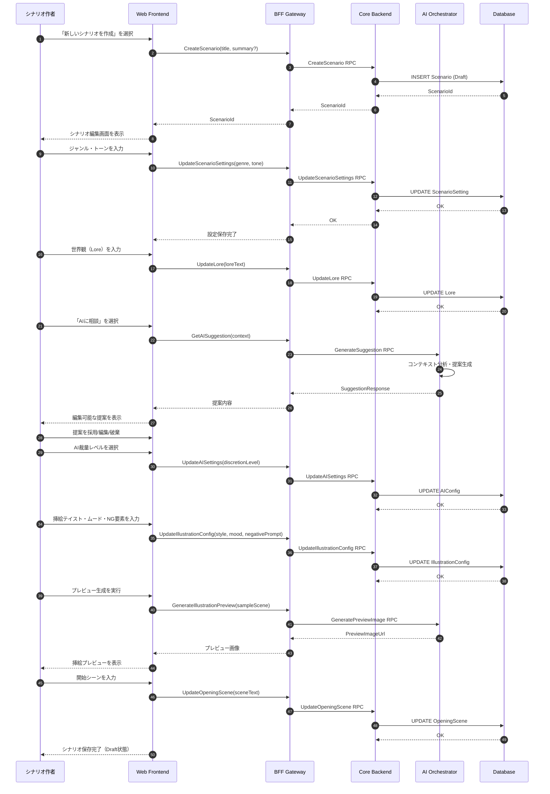
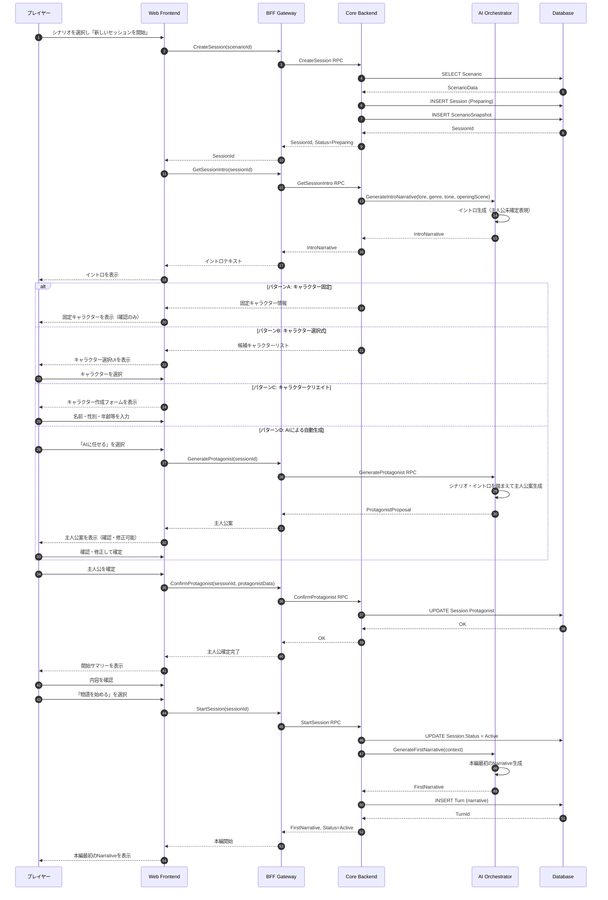
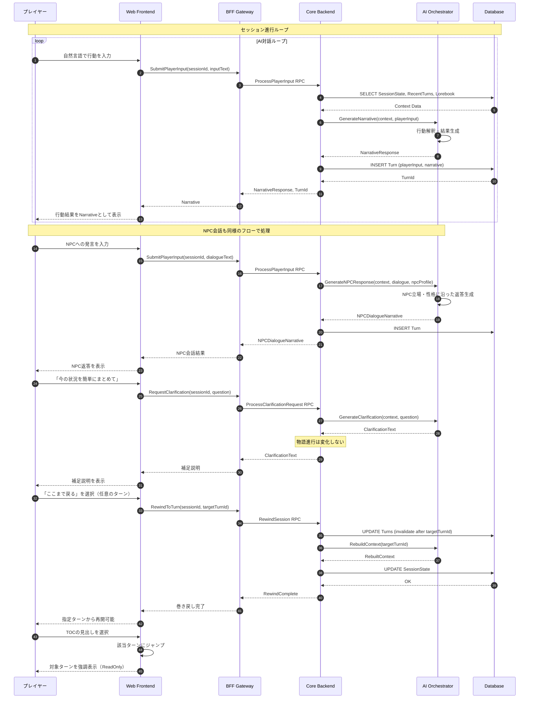
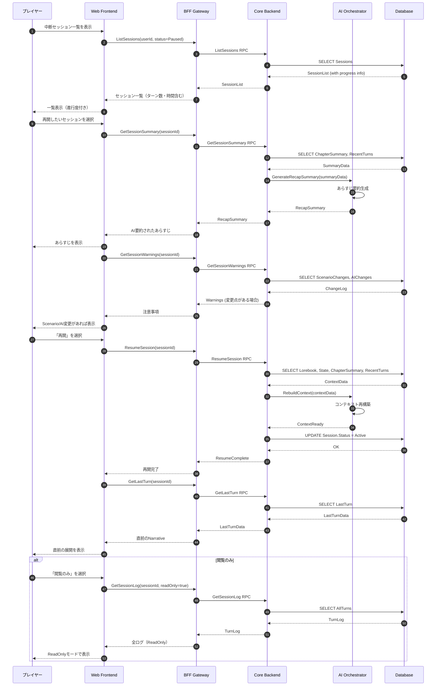
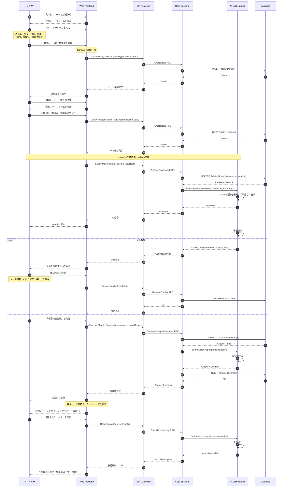
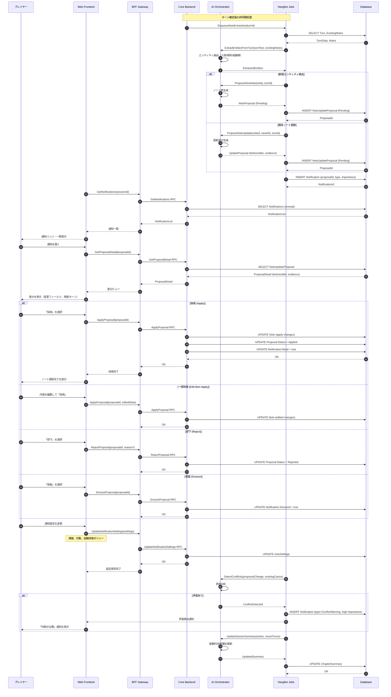
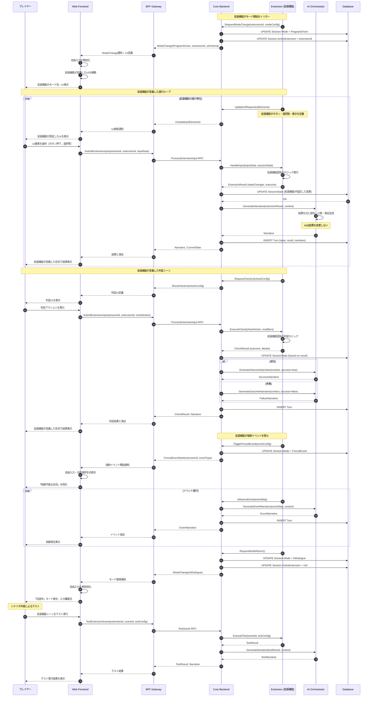
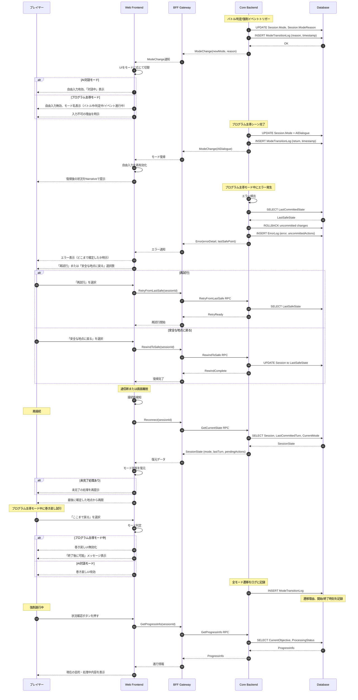
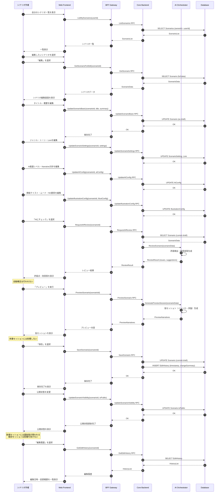
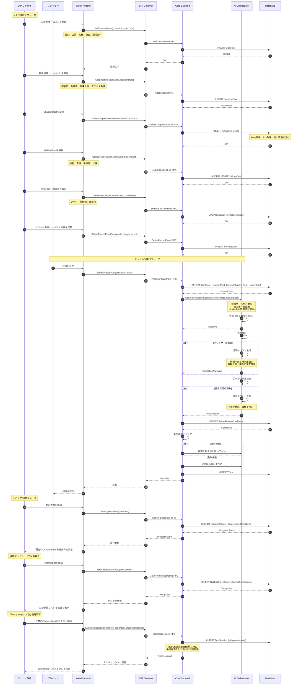

# シーケンスダイアグラム（ユーザーストーリー視点）

本ドキュメントは、AI Text RPG Platformの主要なユーザーストーリーを  
シーケンスダイアグラムとして可視化する。

各ダイアグラムは以下の観点を明確化する：
- **誰が**: 操作主体（プレイヤー、シナリオ作者、システム）
- **どんな目的で**: 達成したいゴール
- **どのような操作や入力を行い**: 具体的なアクション
- **その結果何が起きるのか**: システムの応答と状態変化

---

## 目次

1. [シナリオ登録フロー](#1-シナリオ登録フロー)
2. [セッション開始フロー](#2-セッション開始フロー)
3. [セッション進行（AI対話モード）フロー](#3-セッション進行ai対話モードフロー)
4. [セッション再開フロー](#4-セッション再開フロー)
5. [ノート（Lorebook）管理フロー](#5-ノートlorebook管理フロー)
6. [ノートの自動生成・通知フロー](#6-ノートの自動生成通知フロー)
7. [プログラム主導ナラティブフロー](#7-プログラム主導ナラティブフロー)
8. [モード遷移・例外系フロー](#8-モード遷移例外系フロー)
9. [シナリオ編集フロー](#9-シナリオ編集フロー)
10. [高度なシナリオ実行フロー](#10-高度なシナリオ実行フロー)

---

## 1. シナリオ登録フロー

### 観点
- **誰が**: シナリオ作者
- **目的**: 新しいシナリオを作成し、AIが一貫した物語を生成できる土台を作る
- **操作**: シナリオ作成画面でタイトル・ジャンル・世界観・AI設定・挿絵設定を入力
- **結果**: Draftシナリオが保存され、以降のセッションで使用可能になる

### シーケンスダイアグラム（US-01〜US-06, US-11〜US-22）

---

## 2. セッション開始フロー

### 観点
- **誰が**: プレイヤー
- **目的**: 選択したシナリオから新しいセッションを開始し、物語体験を始める
- **操作**: シナリオ選択 → イントロ閲覧 → 主人公確定 → セッション開始
- **結果**: セッションがActive状態になり、本編の物語が開始される

### シーケンスダイアグラム（US-S01〜US-S05）

---

## 3. セッション進行（AI対話モード）フロー

### 観点
- **誰が**: プレイヤー
- **目的**: AIと自然言語で対話しながら物語を自由に進める
- **操作**: 自然言語で行動入力 → AI応答確認 → 次の行動入力...のループ
- **結果**: Turn単位で物語が進行し、セッションログが蓄積される

### シーケンスダイアグラム（US-P01〜US-P11）

---

## 4. セッション再開フロー

### 観点
- **誰が**: プレイヤー
- **目的**: 中断したセッションを途中から再開し、続きを遊ぶ
- **操作**: セッション一覧から選択 → あらすじ確認 → 再開
- **結果**: AIコンテキストが復元され、最終状態から物語を継続できる

### シーケンスダイアグラム（US-R01〜US-R08）

---

## 5. ノート（Lorebook）管理フロー

### 観点
- **誰が**: プレイヤー
- **目的**: 人物・場所等の詳細情報を構造化して管理し、AIのブレ防止とトークン削減に活用
- **操作**: ノート新規作成 → 詳細入力 → 確定度設定 → 保存
- **結果**: Lorebookが構築され、Narrative生成時に参照される

### シーケンスダイアグラム（US-L01〜US-L10）

---

## 6. ノートの自動生成・通知フロー

### 観点
- **誰が**: システム（AI主導）、プレイヤー（確認・採用）
- **目的**: AIが重要情報を検出してノート案を自動生成し、ユーザーに確認を求める
- **操作**: 通知確認 → 差分レビュー → 採用/却下/保留
- **結果**: 手動入力の手間を減らしつつ、ノートが育成される

### シーケンスダイアグラム（US-AN01〜US-AN07）

---

## 7. プログラム主導ナラティブフロー

### 観点
- **誰が**: システム（プログラム）、プレイヤー（選択入力）
- **目的**: 拡張機能が定義したルールに基づいてプログラムで確実に処理し、公平性と再現性を保つ
- **操作**: 拡張機能が設定したUI要素による入力 → プログラム判定 → AI演出生成
- **結果**: ルールに基づいた結果が確定し、AIは演出のみを担当する

### 設計方針
- **拡張可能なアーキテクチャ**: プログラム主導モードの具体的な機能（バトル、判定、イベント等）は拡張機能として実装される
- **UI要素の動的構成**: 拡張機能がUI要素（ボタン、選択肢、表示パネル等）を定義し、Core/BFF経由でFrontendに配信する
- **ユーザー入力のルーティング**: ユーザー入力はCore経由で拡張機能が処理ロジックを担当する
- **汎用インターフェース**: Core/BFF/Frontendは拡張機能に依存しない汎用APIを提供する

### シーケンスダイアグラム（US-PG01〜US-PG10）

---

## 8. モード遷移・例外系フロー

### 観点
- **誰が**: システム、プレイヤー
- **目的**: AI対話モードとプログラム主導モードを安全に切り替え、エラーや中断からも復帰できる
- **操作**: システム自動遷移 / エラー発生時の復帰操作
- **結果**: 状態不整合を防ぎ、セッションが破損しない

### シーケンスダイアグラム（US-M01〜US-M08）

---

## 9. シナリオ編集フロー

### 観点
- **誰が**: シナリオ作者
- **目的**: 既存シナリオを編集・改善し、品質を向上させる
- **操作**: シナリオ選択 → 編集 → AIチェック → プレビュー → 保存/公開
- **結果**: シナリオが更新され、新規セッションに反映される（既存セッションは影響なし）

### シーケンスダイアグラム（US-E01〜US-E10）

---

## 10. 高度なシナリオ実行フロー

### 観点
- **誰が**: シナリオ作者（設計時）、システム（実行時）、プレイヤー（体験時）
- **目的**: 候補プール・進行制御・非公開情報を使ってAIを監督し、長編・伏線回収が可能な物語を実現
- **操作**: シナリオ設計 → セッション実行 → AI軌道修正 → デバッグ確認
- **結果**: 予測可能で再現性のある物語進行が実現される

### シーケンスダイアグラム（US-AS01〜US-AS12）

---

## 付録: システムコンポーネント凡例

本ドキュメントで使用するシステムコンポーネントは以下の通り：

| コンポーネント | 説明 |
|--------------|------|
| **Web Frontend** | TypeScript + React系のブラウザアプリケーション |
| **BFF Gateway** | gRPC-Web終端、認証・認可を担当 |
| **Core Backend** | Session/Notes/State管理、Single Source of Truth |
| **AI Orchestrator** | AI Router/Context Builder/Sanitizer |
| **Extension (拡張機能)** | プラグイン形式の拡張機能。UI要素定義・入力処理・ルール実行を担当 |
| **Hangfire Jobs** | 非同期ジョブ（挿絵生成、ノート抽出、要約更新） |
| **Database** | PostgreSQL（メインDB） |
| **Local Gateway** | 自宅PC側のローカルAI実行環境（オプション） |

---

## 更新履歴

| 日付 | 内容 |
|------|------|
| 2024-XX-XX | 初版作成 |

---

## 関連ドキュメント

- [README.md](../README.md) - プロジェクト概要
- [docs/user-stories/](./user-stories/) - ユーザーストーリー詳細
- [docs/architecture.md](./architecture.md) - アーキテクチャ詳細（予定）
- [docs/grpc-protos.md](./grpc-protos.md) - gRPC定義（予定）
